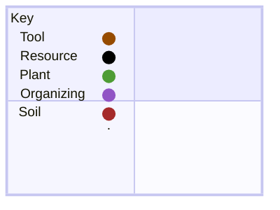
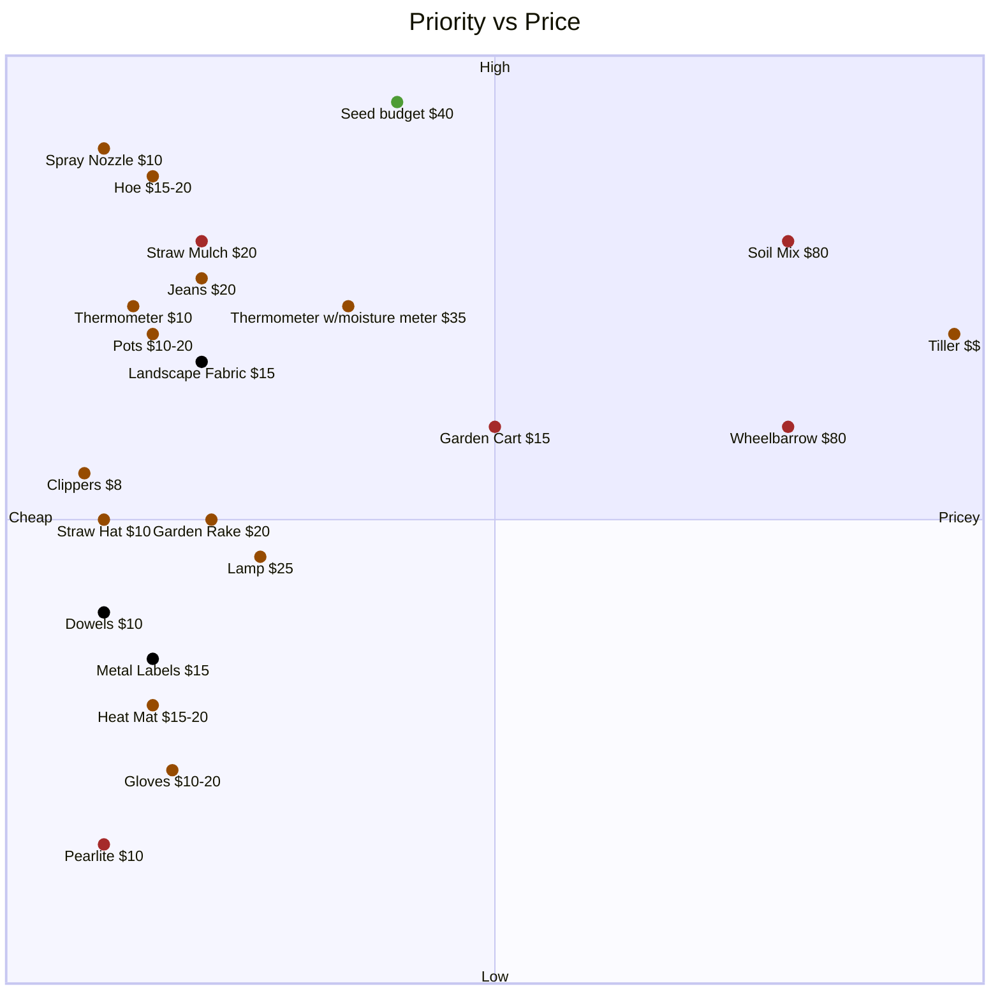

categories:

tools, resources, plants, organization
### List with rough prices & priority
*priority: low, med, high*
*prices: price/10, with 100 clamping at 0.9 and higher being set at 1*

##### Tool
- Cardboard: free
- Grow Containers (pots, grow bags, 5 gallon buckets): $10-20
- Hoe: $15-20
- Garden gloves: $10
- Wheelbarrow: $80
- Garden Cart: $50
- Thermometer: $10
- Thermometer w/moisture meter: $35
- Spray Nozzle: $10
- Lamp: $25
- Heated mat: $15~
- Jeans: $20
- Tiller: expensive
- Clippers: $8
- Straw hat: $10
- Garden Rake: $20
##### Resource
- Landscape Fabric: $20
- Labels: $15
- Dowels/Stakes: $10
##### Plant
- Seed budget: $40
##### Organizing
- Something for a worktable in the lower storage room
##### Soil
- Straw Mulch
- Soil mix:
	- Hardwood Mulch - 1 bag (medium priority) $20
	- Leaf Bagged Product -  2 bags (higher priority) $40
	- Peat Moss - 1 bag (higher priority) $20
	- Pearlite - small amount (lower priority) $10

### Sorted by price vs priority

