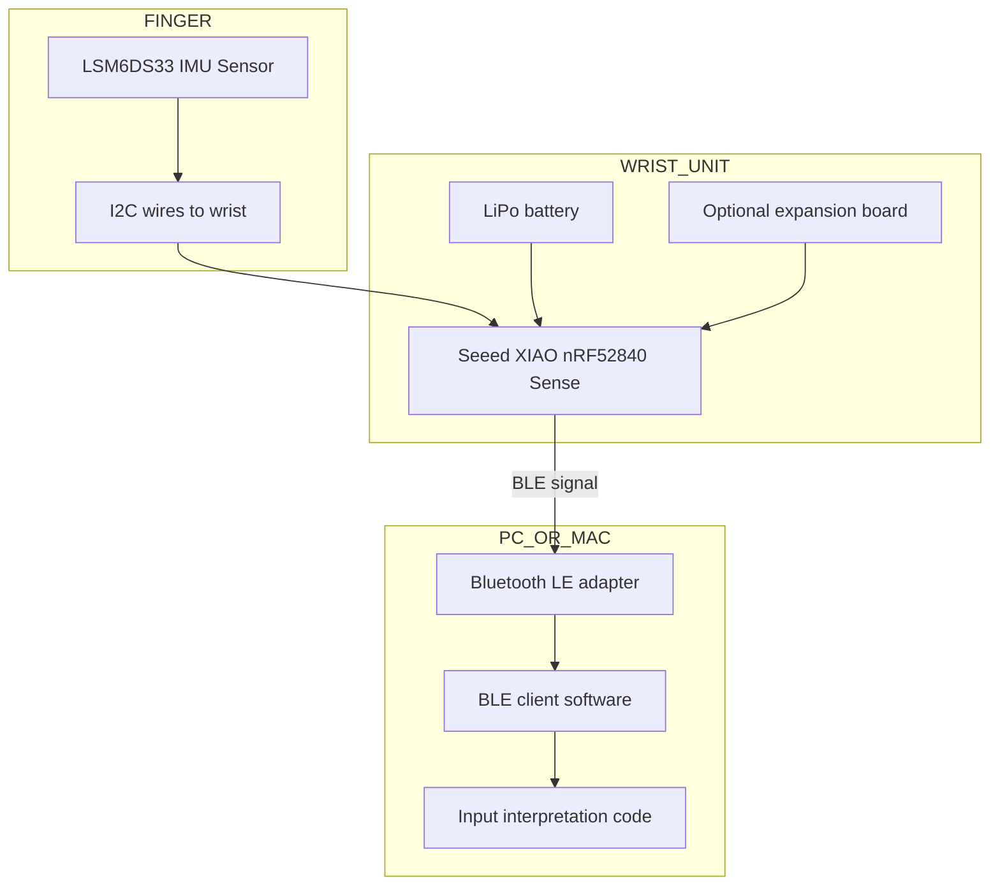

# Research
- **Bluetooth Board:** Seeed XIAO nRF52840
		- Standard: Bluetooth Low Energy (BLE 5.0) - built around Nordic nRF52840 SoC - this uses BLE and *not* Bluetooth Classic, which is apparently the standard for many basic peripherals.
		- This allows for better data granularity and power consumption
		- Devices we can test: Fitness shit, Watch stuff, etc. etc.
	- **LiPo Battery**
	- **Optional charging board**
	- 
- **Sensor Device:** LSM6DS33 IMU Sensor
	- I2C Wires for connection
- **Software:** Python scripts using `bleak`
	- Testing with `bleak` as well as `nRF-Connect` (see Development)


**Supplies List:**
- [ ] Seeed XIAO nRF52840
	- [ ] Compatible LiPo Battery https://www.adafruit.com/product/3898
	- [ ] Charging board for Seeed Studio https://www.seeedstudio.com/LiPo-Rider-Pro.html
	- [ ] Adafruit TCA9548A I2C Multiplexer (supports multiple I2C connections as below) https://www.adafruit.com/product/2717
- [ ] LSM6DS33 IMU Sensor x 2
	- [ ] I2C Wires - these transmit data, and the Seeed device will need the above multiplexer 
	- [ ] Wire sleeves/sleeve the whole thing up 
	- [ ] Modular/moddable rings (or: tape at first?) x2
- [ ] Basic glove for initial prototyping
- [ ] Compression glove to sew into


# Plan
## First iteration
One or two fingers with a ring + wrist battery and control board -> Bluetooth -> computer for managing device while wearing XReal

## Dream iteration
- This but as a whole glove.
- Vibration motor for haptic feedback
- More channels

# Phases
## Development
Do this on **macOS**, **Windows**, and **Linux** (FYI: Linux is a bonus, as XReal is not compatible. But a control glove for all devices would be shweet)
- Python using[ Bleak ](https://github.com/hbldh/bleak)(cross-platform)
- [nRF-Connect](https://www.nordicsemi.com/Products/Development-tools/nRF-Connect-for-desktop) - a testing application I can use to simply test out the connected devices, I believe?

See this for more info:
https://chatgpt.com/g/g-p-683f167ad95c8191b905cc7f208b0834-personal/c/68486ad6-8308-8011-95b9-1566b89e7551*
#### Software
*Scan for available BLE devices*
```python
import asyncio
from bleak import BleakScanner
async def main():
	devices = await BleakScanner.discover()
	for d in devices:
		print(d)
asyncio.run(main())
```
**NOTE**: "Many Bluetooth mice use **Bluetooth Classic**, not BLE."
"For testing **BLE characteristics**, use a BLE fitness band, heart rate monitor, or a second microcontroller if needed."

*Subscribe to a characteristic and print values
```python
import asyncio
from bleak import BleakClient

address = "24:71:89:cc:09:05"
MODEL_NBR_UUID = "2A24"

async def main(address):
    async with BleakClient(address) as client:
        model_number = await client.read_gatt_char(MODEL_NBR_UUID)
        print("Model Number: {0}".format("".join(map(chr, model_number))))

asyncio.run(main(address))

```


## Final Flowchart
Initially generated by ChatGPT, this will be updated as we go.

